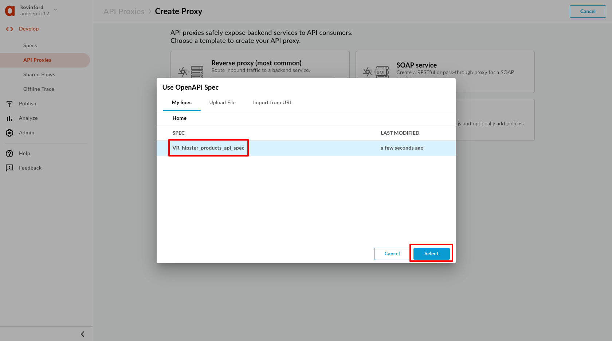
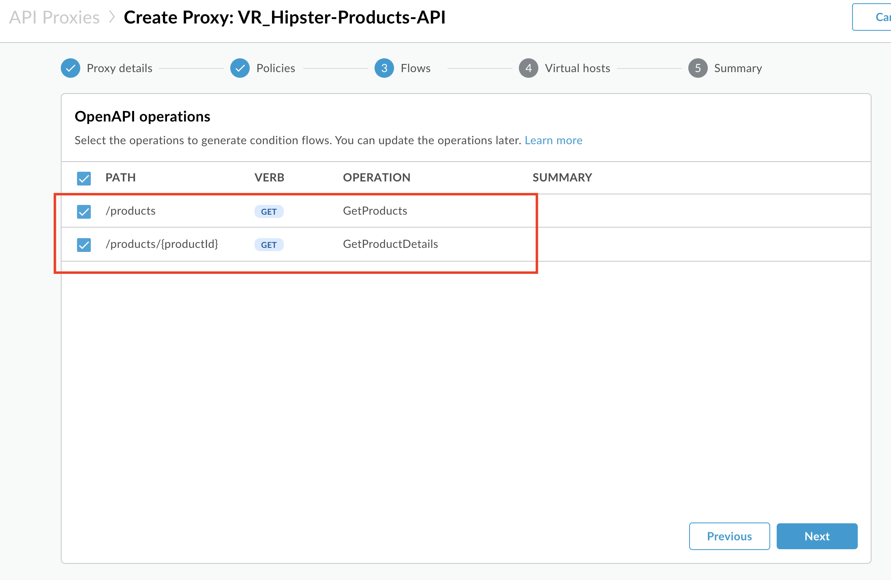
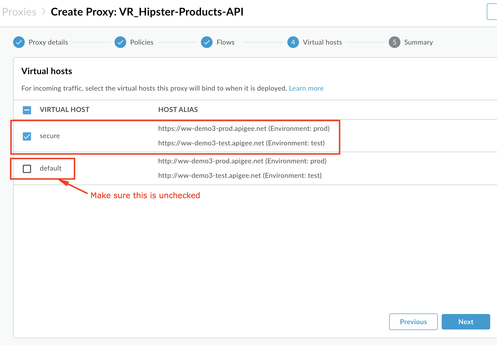
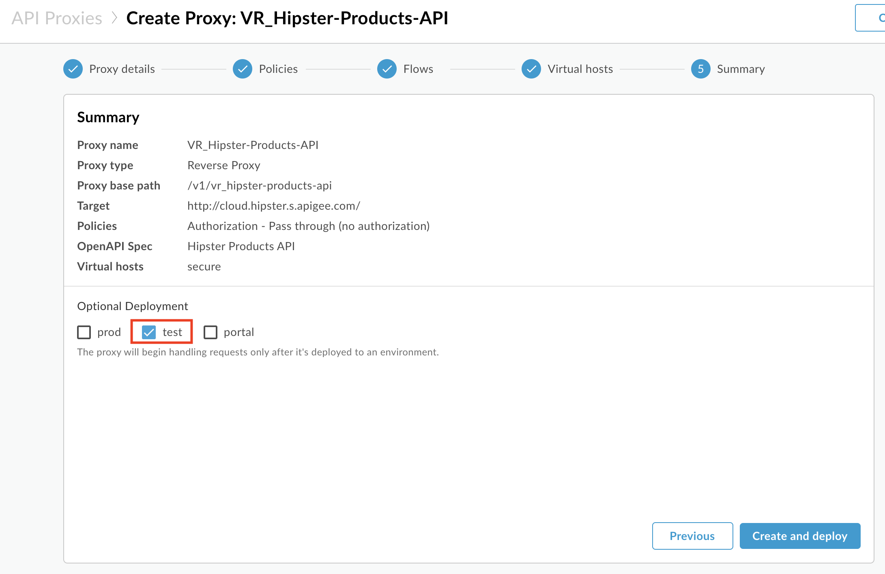
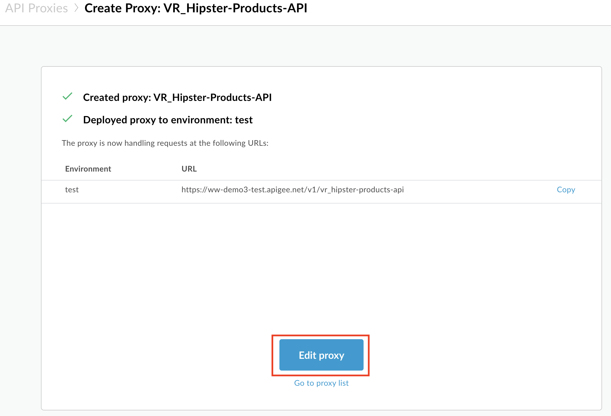

# Lab 1 - Design & Create an API Proxy with OpenAPI Specification

*Duration : 15 mins*

*Persona : API Team*

# Use case

You have a requirement to create a reverse proxy for taking requests from the Internet and forward them to an existing service. You have decided to follow a design first approach & built a reusable component, a specification which can be used to build API Proxies, generate API documentation, generate API test cases, etc., using OpenAPI Specification format. You would like to generate an Apigee API Proxy by using the OpenAPI Specification (Swagger) instead of building the API Proxy from scratch.

# How can Apigee API Management help?

Apigee enables you to quickly expose services as APIs. You do this by creating an [**API proxy**](https://docs.apigee.com/api-platform/fundamentals/understanding-apis-and-api-proxies#whatisanapiproxy), which provides a facade for the service that you want to expose, such as existing API endpoints, generic HTTP services, or applications (such as Node.js). The API proxy decouples your service implementation from the API endpoint that developers consume. This shields developers from future changes to your services. As you update services, developers, insulated from those changes, can continue to call the API uninterrupted.
On Apigee, the API Proxy is also where runtime policy configuration is applied for API Management capabilites. For further information, please see: [Understanding APIs and API Proxies](https://docs.apigee.com/api-platform/fundamentals/understanding-apis-and-api-proxies#whatisanapiproxy).


Apigee also supports the [**OpenAPI specification**](https://swagger.io/specification/) out of the box, allowing you to auto-generate API Proxies. Apigee has a built-in OpenAPI specification editor & store which you can use to design and maintain your OpenAPI specifications. 


In this lab, we will see how to 
* design an OpenAPI specification for an existing HTTP service and store it within the Apigee platform, and
* create an API proxy, that routes inbound requests to the existing HTTP service.

# Pre-requisites

* Basic understanding of [OpenAPI Specification](https://github.com/OAI/OpenAPI-Specification) (Swagger)
* Access to a HTTP client to test the API (eg. cURL, Postman, etc.). If you do not have access to one, you can use the [Apigee Trace Tool](https://docs.apigee.com/api-platform/debug/using-trace-tool-0).

# Instructions

**Note: During this workshop, as you may be working within an [Apigee Org](https://docs.apigee.com/api-platform/fundamentals/apigee-edge-organization-structure) that is shared by multiple users, please prefix all asset names within the Org, with your initials. For example, Spec name = {your-initials}\_{spec name}, API proxy name = {your-initials}\_{proxy name}, etc.**

## Create an Open API Specification

During the course of this lab, the sample HTTP service we will expose as an API endpoint, is the Hipster Products service located at [http://cloud.hipster.s.apigee.com/products](http://cloud.hipster.s.apigee.com/products).
First, we are going to design and create an OpenAPI specification for the different resource endpoints, i.e. /products and /products/{productId}. 

1. Go to [https://apigee.com/edge](https://apigee.com/edge) and log in. This is the Apigee management UI. 

2. Select **Develop → Specs** in the side navigation menu


3. As we have a pre-designed sample of the spec available for this lab, we will be importing it into your Apigee Org's Spec Store. Click **+Spec**. Click on **Import URL** to add a new spec from existing source.


4. Enter spec details. Replace **{your-initials}** with the initials of your name.

   * File Name: **{your-initials}**_hipster_products_api_spec
   * URL: [https://raw.githubusercontent.com/aliceinapiland/apijam/master/Module-1/Resources/products-catalog-spec.yaml](https://raw.githubusercontent.com/aliceinapiland/apijam/master/Module-1/Resources/products-catalog-spec.yaml)


5. Verify the values and click **Import**. Spec has been imported into Apigee & Ready to use. You should see your spec in the list. For example,


6. Click on **{your-initials}**\_hipster_products_api_spec from the list to access Open API spec editor & interactive documentation that lists API details & API Resources.


## Create an API Proxy

1. It’s time to create Apigee API Proxy from Open API Specification. Click on **Develop → API Proxies** from side navigation menu.


2. Click **+Proxy** The Build a Proxy wizard is invoked. 


3. Select **Reverse proxy**, Click on **Use OpenAPI** below reverse proxy option.


4. You should see a popup with list of Specs. Select **{your-initials}**\_hipster_products_api_spec and click **Select.** 



5. Enter details in the proxy wizard. Replace **{your-initials}** with the initials of your name. 

    * Proxy Name: **{your_initials}**\_Hipster-Products-API

    * Proxy Base Path: /v1/**{your_initials}**\_hipster-products-api

    * Existing API: Observe the field value which is auto filled from OpenAPI Spec.


6. Verify the values and click **Next**.

7. Select **Pass through (none)** for the authorization in order to choose not to apply any security policy for the proxy. Click Next. 


8. You can select, de-select list of API Proxy Resources that are pre-filled from OpenAPI Spec. Select all & Click on **Next**



9. Go with the **secure Virtual Host** configuration. Ensure that the **default** one is unchecked.



10. Ensure that only the **test** environment is selected to deploy to and click **Create and Deploy** 



11. Once the API proxy is created and deployed click **Edit Proxy** to view your proxy in the proxy editor. 



12. *Congratulations!* ...You have now built a reverse proxy for an existing backend service. You should see the proxy **Overview** tab.


## Test the API Proxy
Let us test the newly built API proxy. You can use any HTTP client like cURL or Postman, or the [Apigee Trace Tool](https://docs.apigee.com/api-platform/debug/using-trace-tool-0). 

### Using cURL

org = Organization name
env = Environment where API is deployed

```
curl -X GET "https://{{org}}-{{env}}.apigee.net/{{your initials}}_hipster-products-api/products"
```

### Using Trace Tool:

* Navigate to your proxy's **Trace** tab.

* Ensure that the deployed API revision is selected.

* Hit **Start Trace Session**.

  

* Wait for Trace session to start.

* Modify the URL to send to a valid API resource - **append a '/products' to the end of the URL.**

* Hit 'Send'.


* You will see that the API proxy recieved the request and sent back a HTTP status 200 response which was logged by the Trace session. You can click on the step shown below to view the response body.


## Save the API Proxy

1. Let’s save the API Proxy locally as an API Bundle so that we can reuse it in other labs.

2. Save the API Proxy by downloading the proxy bundle, See screenshot below for instructions.


# Lab Video

If you like to learn by watching, here is a short video on creating a reverse proxy using Open API Specification - [https://www.youtube.com/watch?v=3XBG9QOUPzg](https://www.youtube.com/watch?v=3XBG9QOUPzg) 

# Earn Extra-points

Now that you have created a reverse proxy using OpenAPI spec, Click on the Develop tab & explore the flow conditions populated from OpenAPI spec. Also, Explore OpenAPI Spec editor using which you can edit OpenAPI specification & Generate API Proxy using the link above the OpenAPI Spec editor. Explore trace tab in Proxy overview page.

# Quiz

1. How do you import the proxy bundle you just downloaded? 
2. How does Apigee handle API versioning? 
3. Are there administrative APIs to create, update or delete API proxies in Apigee?

# Summary

That completes this hands-on lesson. In this simple lab you learned how to create a proxy for an existing backend using OpenAPI Specification and Apigee proxy wizard.

# References

* Useful Apigee documentation links on API Proxies - 

    * Build a simple API Proxy - [http://docs.apigee.com/api-services/content/build-simple-api-proxy](http://docs.apigee.com/api-services/content/build-simple-api-proxy) 

    * Best practices for API proxy design and development - [http://docs.apigee.com/api-services/content/best-practices-api-proxy-design-and-development](http://docs.apigee.com/api-services/content/best-practices-api-proxy-design-and-development) 

* Watch this 4minute video on "Anatomy of an API proxy" - [https://youtu.be/O5DJuCXXIRg](https://youtu.be/O5DJuCXXIRg) 

# Rate this lab

How did you like this lab? Rate [here](https://goo.gl/forms/G8LAPkDWVNncR9iw2).

Now go to [Lab-2](../Lab%202)

