## Module 3 - Lab 1 : Global policy management using Shared Flows, Flow Hooks and Flow Callouts
# Policy Management : Shared Flows

*Duration : 20 mins*

*Persona : API Team / Policy Management*

# Use case:

You are tasked with designing multiple API proxies for your organization, your APIs have similar requirements with respect to Security, Logging and Mediation. You are looking to define a standard implementation for these requirements and would also like a means to enforce certain requirements that all new APIs with your organization should adhere to from an API Governance and Policy management point of view.

# How can Apigee Edge help?

By exposing an API through Apigee Edge, you gain the ability to modify and monitor its behavior using out-of-the-box policies. Edge's out-of-the-box policies enable you to enhance your API with sophisticated features to control traffic, enhance performance, enforce security, and increase the utility of your APIs, without requiring you to write any code or to modify any backend services. 

In additon to these policies, Apigee Edge also provides for manner to group multiple of these policies into a single re-usable collection called Shared Flows. Shared Flows gives you an ability reuse policies / best practices across different API proxies and even across different teams. Furthermore Apigee Edge also provides concepts of flow hooks by which you can have these shared flows invoked automatically within any new proxy that is created within your organization, hence eliminating the need to explicitly callout flows and enforcing API Governance centrally.


# Prerequisites

* Basic understanding of [OpenAPI Specification](https://github.com/OAI/OpenAPI-Specification) (Swagger)
* Basic understanding of OAuth v2 and Apigee Proxy-Product-App concepts. As a primer, you can complete a previous [set of labs on API Security](../../../Module-2a). Alternatively, go through the ["Getting started guide"](https://docs.apigee.com/api-platform/get-started/get-started) in the Apigee Docs site.
* Download the following proxy bundle: [Advanced-Hipster-Products-API](./Resources/Advanced-Hipster-Products-API.zip)
* Download the following proxy bundle: [oauth](./Resources/oauth.zip)
* Access to a REST client like [Apigee REST Client](https://apigee-restclient.appspot.com).

# Instructions

In this lab we will see how we can bundle certain out of the box policies, that you have already used in our labs, like traffic management policy(Spike Arrest) and Security (OAuth) into a shared flow and have this shared flow invoked within your proxy using the flow callout feature. 

## Create and Deploy a Shared Flow

1. Go to [https://apigee.com/edge](https://apigee.com/edge) and log in. This is the Edge management UI. 

2. Select **Develop → Shared Flows** in the side navigation menu.


3. Click the **+Shared Flow** button on the top-right corner to invoke the **+New Shared Flow** wizard. 


4. Provide a name and description for your shared flow.
```
Name: {your initials}-shared-flow
Description: Shared flow with Spike Arrest and OAuth
```
 Note - To avoid confusion with others members in your Apigee organization, you could prefix your shared flow with your initials.


5. Verify that an empty shared flow is created by selecting **Develop** tab in the right side menu.


* Shared flow will look similar to a proxy that you have build in previous modules of this APIJam.

Note- Although a **shared flow** appears to look like a proxy, a shared flow has no endpoint. It can be used only from an actual API proxy or shared flow that is in the same organization as the shared flow itself.

* Click on **Deployment** and select the **test** environment to deploy the flow to the test environment. 


* You will be prompted with a dialog box to confirm the deployment to environment "test", click on **Deploy**.


6. Now lets add the policies we want to be part of this FLOW, Click on **default** section under Shared Flows, and then click on **+Step** on the upper right of the Request flow to attach a Spike Arrest policy.


7. Select **Spike Arrest Policy**. Click on **Add** button to add the spike arrest policy to the shared flow canvas.


8. Note the Spike Arrest policy icon on top of request flow that shows exactly where the policy is attached. Select the policy to display the policy's XML configuration in the editor. What you now see is the default XML configuration for the Spike Arrest Policy.


9. Change the Policy XML configuration to the below snippet to enforce a rate of 12 requests per minute.
```
<?xml version="1.0" encoding="UTF-8" standalone="yes"?>
<SpikeArrest async="false" continueOnError="false" enabled="true" name="Spike-Arrest-1">
    <DisplayName>Spike Arrest-1</DisplayName>
    <Properties/>
    <Rate>12pm</Rate>
    <UseEffectiveCount>true</UseEffectiveCount>
</SpikeArrest>
```

10. Similary, Lets add the **OAuth v2.0** Policy to ensure that an API Token based security is enforced in all APIs that are using this flow. 


11. Please drag your OAuth v2.0 policy to execute before the Spike Arrest policy, and then click **Save**.


## Testing your shared flow using Flow Callouts and Flow Hooks

Your shared flow is now ready for testing. As discussed earlier, Shared flows do not have actual backend implementations, hence for testing our shared flow we will need to either invoke this within a proxy via an explicit **flow callout** or have this flow attached to a **flow hook**. 

### Import and configure the ***Advanced Hipster Products API*** Proxy and OAuth proxy

1. Go to [https://apigee.com/edge](https://apigee.com/edge) and log in. This is the Edge management UI.
Here, Select **Develop** → **API Proxies** in the side navigation menu and click the **+Proxy** button on the top-right corner to invoke the Create Proxy wizard.

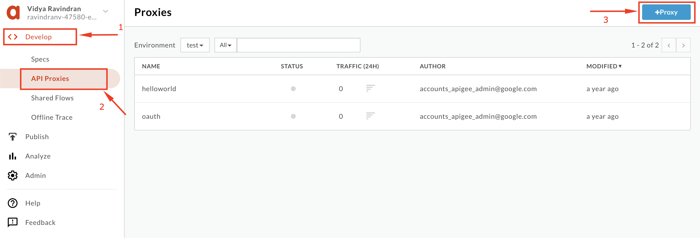

2. Select the **Upload Proxy Bundle** option, to import an existing proxy form a zip archive.


3. Click "Drag and drop file here or click to upload", and select the ***“Advanced-Hipster-Products-API.zip”*** file you downloaded in the **[Prerequisites](https://github.com/apigee/apijam/tree/master/Module-3/Labs/Lab%201#prerequisites)** section, and click **Next**:


4. Review the Summary and Click **Create**:

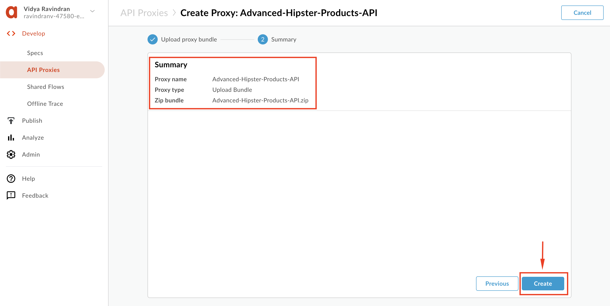

5. Once the proxy is successfully uploaded, click **'Edit Proxy'**.


6. To deploy the proxy, click the **Deployment** dropdown and select the **test** environment. In the pop-up window, click **Deploy**:


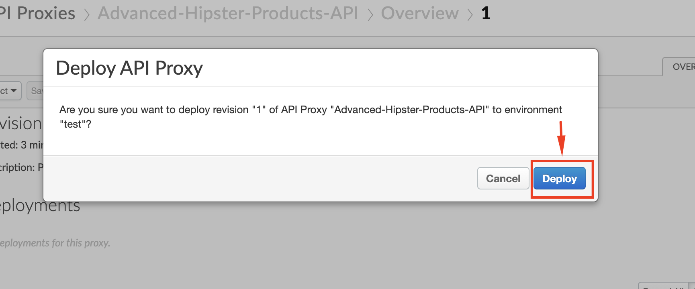

7. **If you do not already have a proxy in your org for OAuth (typically named 'oauth'), then:** Repeat steps 1-6 above for the **"oauth"** proxy that you downloaded in the **[Prerequisites](https://github.com/apigee/apijam/tree/master/Module-3/Labs/Lab%201#prerequisites)** section.

8. Navigate back to the API proxy list and select the **Advanced Hipster Products API**. 


9. Click the **Develop** tab in the proxy editor.

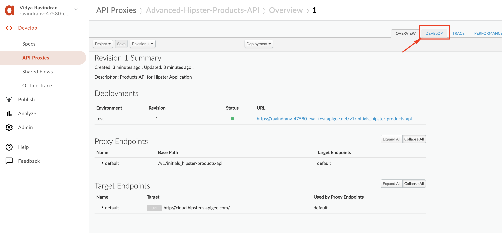

10. Select the **PreFlow** flow and click **+ Step** for the Request pipeline.


11. Select the **Flow Callout** Policy from within ***Extention*** section of the policy menu. Within the **Shared flow** dropdown menu you should see your shared flow. Select it and then click on **Add**.


12. Click **Save**.


### Create API Product, Developer, App and Client Credentials

Follow the steps below to generate a valid set of client credentials (API Key and Secret) to use while testing the shared flow and proxy flow hook.

1. Navigate to the Apigee documentation website at [https://docs.apigee.com](https://docs.apigee.com). Here, select the **Reference** tab and navigate to **Edge API**.


2. Under **API Products**, pick the **Create API Product** management API.

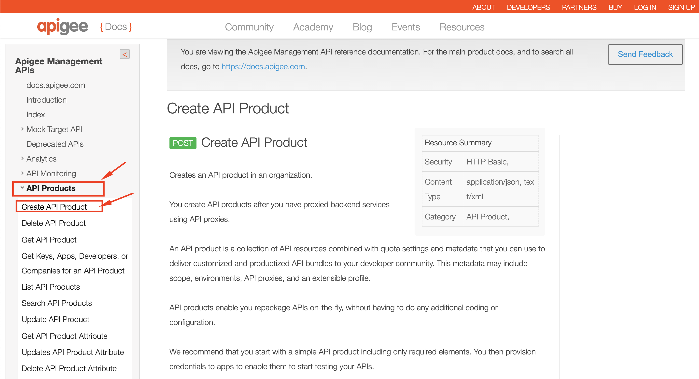


3. Fill out request details as shown below:

* Add org name to URL:
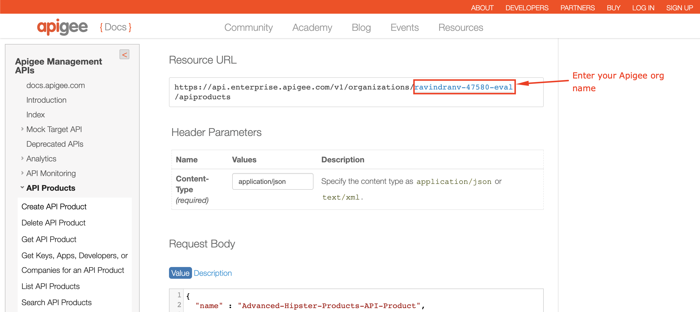

* Add Payload:


* Set Apigee Org authentication:
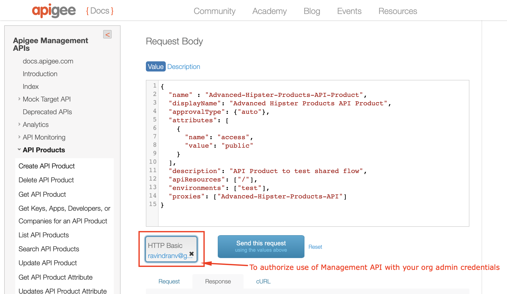


4. Execute the API as shown below, to create a new API Product:

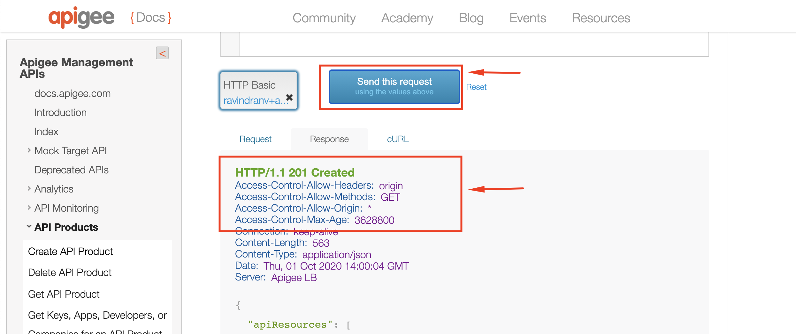

5. Similarly, create a Developer to regiter an App against:

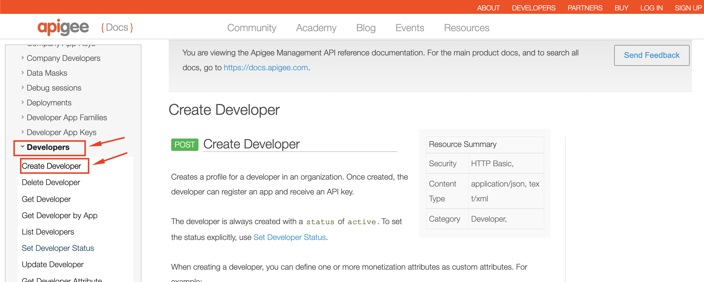


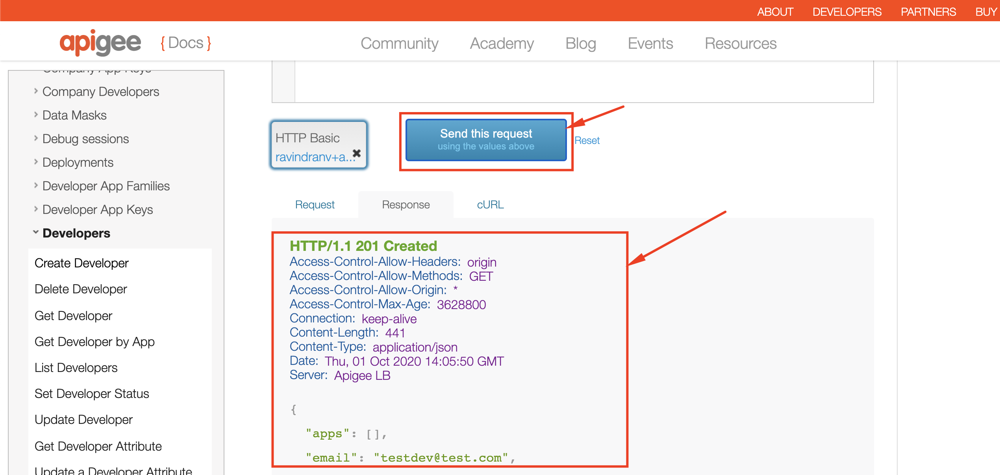

6. Similarly, register an App for the developer we just created:


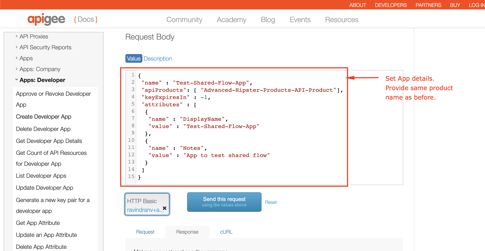

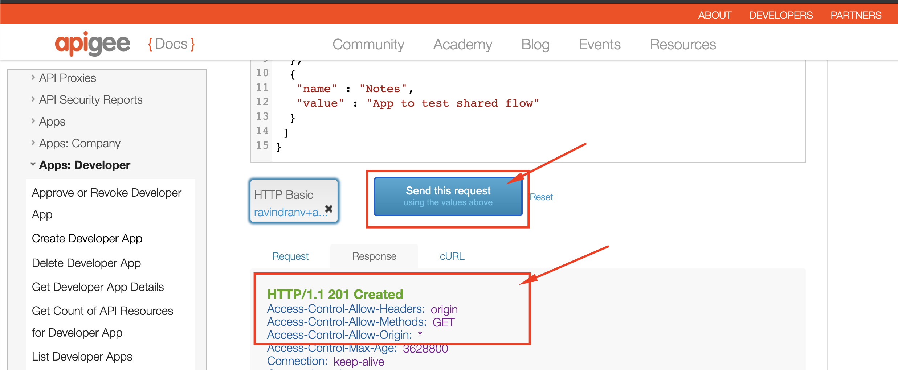

7. Back in the Apigee Management console, Navigate to **Publish** >> **API Products** / **Developers** / **Apps** to see that our API product, developer and app are created.

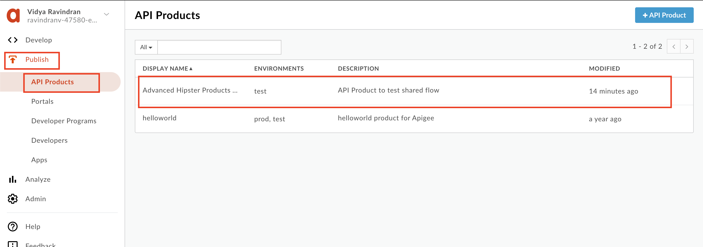

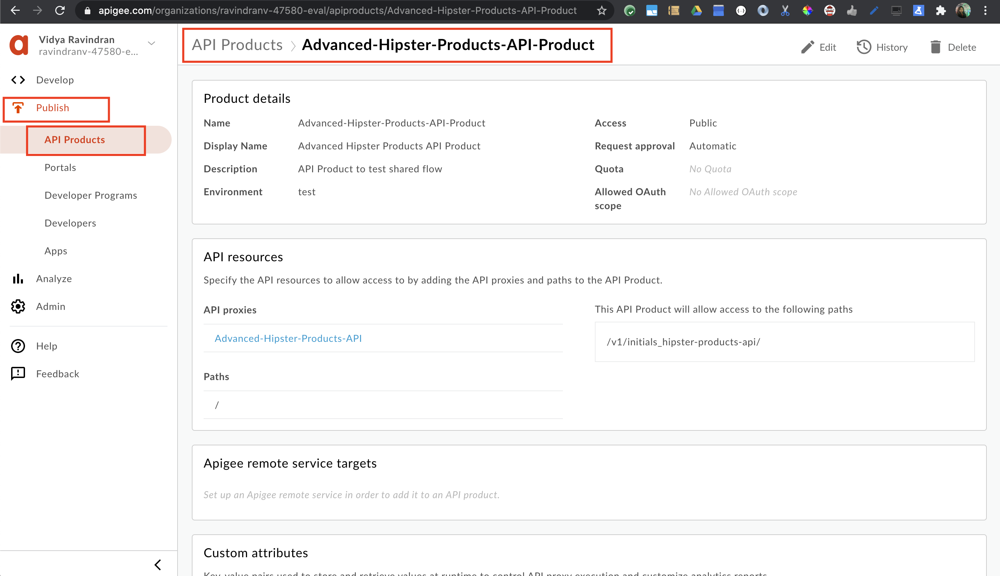


8. On the App overview page for the new App, click **'Show'** and copy both API Key and Secret.


### Generate Access Token

1. Provide the API Key and Secret to the oauth endpoint in your org (thanks to the Oauth proxy we imported) to generate a valid access token. You can do this using the [Apigee REST Client](https://apigee-restclient.appspot.com) or similar REST/HTTP client:

**Request Details:**

Verb: `POST`
Headers:
 Content-Type: `application/x-www-form-urlencoded`
 Accept: `application/json`
Request URL: `https://{your org name}-{your env}.apigee.net/oauth/client_credential/accesstoken?grant_type=client_credentials`
Request Body: `client_id={your API Key}&client_secret={your API Secret}`

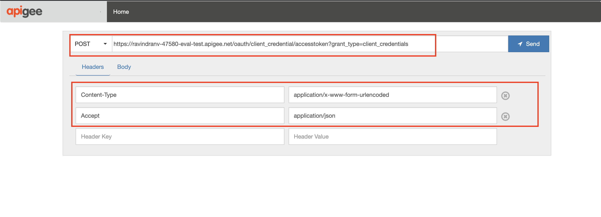


2. Copy and save the access token:

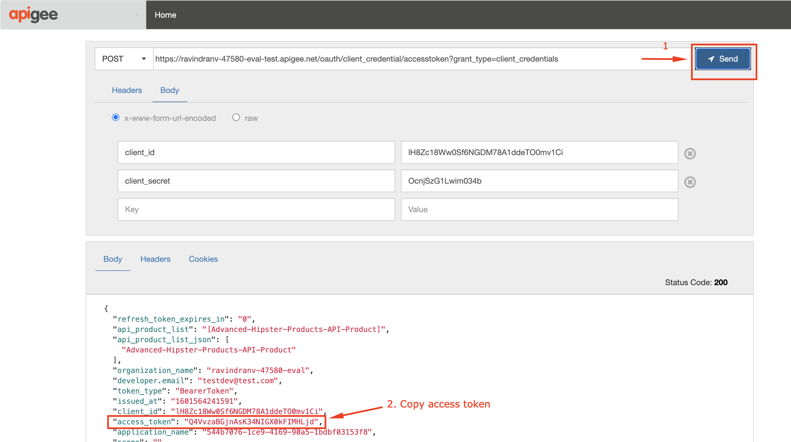


### Test API Proxy and Shared Flow

1. Navigate to **API Proxies** >> **Your Proxy**.


4.  In the **Trace** tab, click **Start Trace Session** to see API Proxy with the Shared Flow in action.


5. Naigate back to the [Apigee REST Client](https://apigee-restclient.appspot.com) and make the API call  as shown below:

Verb: `GET`
Headers:
 Authorization: `Bearer {your access token}`
Request URL: `https://{your org name}-{your env}.apigee.net//v1/advanced-hipster-products-api/products`

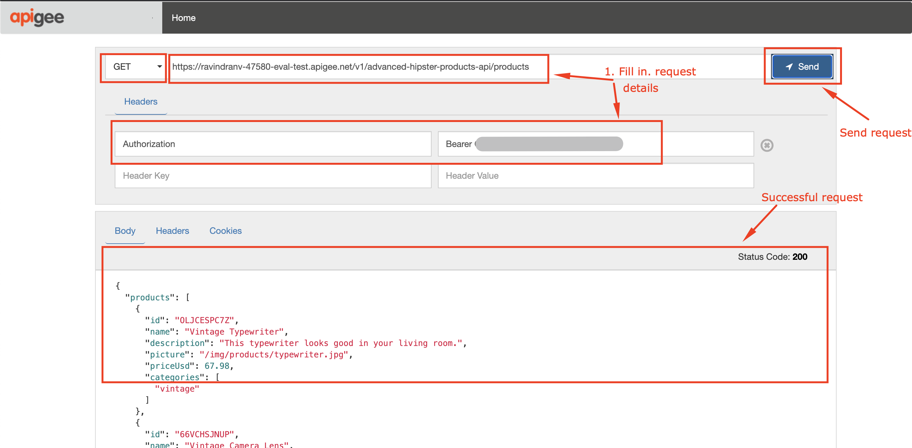

Your should see a ***200 OK*** response with a Listing of the Product catalog in your Response. 
You can also see your API Calls in action within the Trace Tool and will note that the Flow Call out was initiated with Spike Arrest and Oauth policies applied to this call.

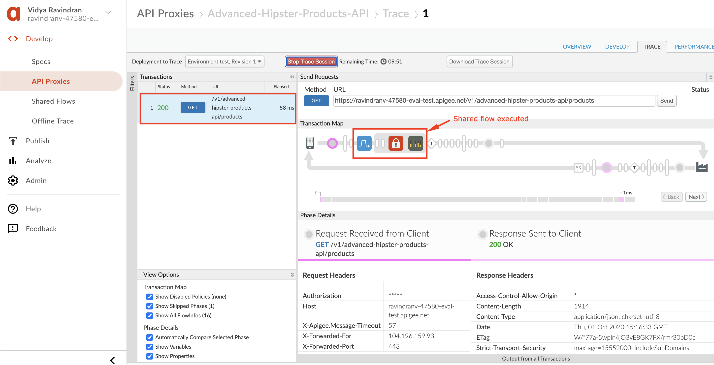

8. Lets re-send the above API call Multiple Times in Quick succession to Engage our Spike Arrest Policy, You should see an error like below:
```
{"fault":{"faultstring":"Spike arrest violation. Allowed rate : MessageRate{messagesPerPeriod=12, periodInMicroseconds=240000000, maxBurstMessageCount=1.0}","detail":{"errorcode":"policies.ratelimit.SpikeArrestViolation"}}}%  
```

This concludes our Lab for Shared Flow execution using the [Flow Callout policy](https://docs.apigee.com/api-platform/reference/policies/flow-callout-policy).

You can follow the steps in the next optional section to attach a Shared Flow using a [Flow Hook](https://docs.apigee.com/api-platform/fundamentals/flow-hooks).

## Optional: Flow Hooks

So far in this Lab, you have seen how to group multiple policies for execution into a single flow and how to invoke flows from within your proxy using the flow call out feature. However, in all of this the onus for ensuring that policy is applied within a proxy is still on the Proxy developer to either include a policy or a flow that will execute the policy. 

***Flow Hooks*** provides a mechanism for an Organization Administrator to enforce a shared flow as a **governance** feature in a manner that mandates to all proxies within an Environment. Think of Flow Hooks as a way to ENFORCE one or more of the Shared Flows to ALL the API Proxies running in a particular environment. This gives you a separately implemented and deployed sequence of logic that is are part of a proxy's implementation code (either directly or referenced through a flowCallout policy).  

## Enforcement Points -

There are 4 enforcement points where you can associate a ***Shared Flow*** to be automatically invoked within your proxy execution. 

***Pre-proxy Flow Hook*** - for logic that needs to be enforced BEFORE a proxy endpoint executes for ALL API Proxies deployed to that environment.

For example, you could have logic for enforcing security across all the APIs in an environment.

***Pre-target Flow Hook*** - for logic that needs to be enforced right BEFORE reaching out to a target backend for ALL API Proxies deployed to that environment.

For example, you could implement logging before the request reaches the backend. You could also enforce mediation by removing certain fields from the request.

***Post-target Flow Hook*** - for logic that needs to be enforced BEFORE the API Proxy response executes for ALL API Proxies deployed to that environment.This will be enforced right after the response comes back from the backend. You can use it to log the backend response or perform some mediation by removing sensitive fields from the backend response.

***Post-proxy Flow Hook*** - for logic that needs to be enforced AFTER the proxy endpoint and right before the response is sent out to the client for ALL API Proxies deployed to that environment.

This could include some enforcement logic for CORS, logging the response, or performing some mashup or formatting.

## Using Flow Hooks
In this last section of our Lab we will see how we can use the Flow Hooks feature to automatically execute the our ***shared flow*** within the ***Hipster Products API*** Proxy.

1) Lets start by removing the flow callout policy that we have within our proxy and click on Save to re-deploy our proxy. As our proxy stands, the current version of our proxy has no policy enforcement in place. So all incoming calls will be relayed to backend without any traffic limiting or OAuth security.

Hint - To remove the flow callout feature we just go to the develop tab within your proxy and click on the x on the top righthand corner of the policy box.


Note - Click on Save to ensure that the new changes are now applied to your proxy.

2) From the left Hand Menu, select Admin -> Environments -> Flow Hooks


3) From the Flow Hooks Options, Select **test** Environment and then click on on the ***Pencil*** Sign on right end of the Pre-Proxy to invoke the ***Pre-Proxy flow*** configuration dailog.


4) Select your ***Shared Flow***from the dropdown and then click OK.


You have now applied your Shared flow to all Proxies within the ***Test*** Enviroment. 

5) To ensure that the Flow Hook is in effect and your shared flow is being applied to your proxies, you can make calls to the 'Hipster Product API' just like before:

Make an API Call to your Hispter Product API using below CURL and Look at the trace:
```
curl -X GET -H "Authorization: Bearer $ACCESS-TOKEN" "https://$ORG_NAME-$ENV.apigee.net/v1/<Your Initials>_hipster-products-api/products"

```

Call Details if you are using a the REST client Tool:
```
Rest Endpoint - https://$ORG_NAME-$ENV.apigee.net/v1/advanced-hipster-products-api/products
Rest VERB - GET
Request Headers-> Value - 
      Authorization ->  Bearer <Your API Token>
```
Note - Be sure to replace <Your Initials> above within the proxy base path.

You should see a 200 OK response with a listing of the Product catalog in your Response. 
You can also see your API Calls in action within the Trace Tool and will note that the Flow Call out was initiated with Spike Arrest and OAuth policies applied to this call.


# Lab Video

If you like to learn by watching, here are some short videos on using [Shared Flows](https://youtu.be/-7xx34uD8Kk) and [Flows Hooks](https://youtu.be/-lP5tI3ppZI).

# Earn Extra-points

Now that you are familiar with the concept of Shared flow and how to invoke them, continue explore more about Shared flows and how you can [invoke one shared flow from another flow.](https://docs.apigee.com/api-platform/fundamentals/shared-flows#calling-a-shared-flow) 

# Summary

That completes this hands-on lesson. In this simple lab you learned how to re-use policies accross multiple proxies using shared flows and flow hooks.

# References

* Useful Apigee documentation links on Flows, Flow Hooks, OAuth, Spike Arrest Policy  - 

    * [Spike Arrest Policy](http://docs.apigee.com/api-services/reference/spike-arrest-policy)

    * [OAuth Policy](https://docs.apigee.com/api-platform/security/oauth/oauth-introduction)

    * [Shared Flows](https://docs.apigee.com/api-platform/fundamentals/shared-flows)

    * [Flow Hooks](https://docs.apigee.com/api-platform/fundamentals/flow-hooks)

Now go to [Lab-2](../Lab%202)

